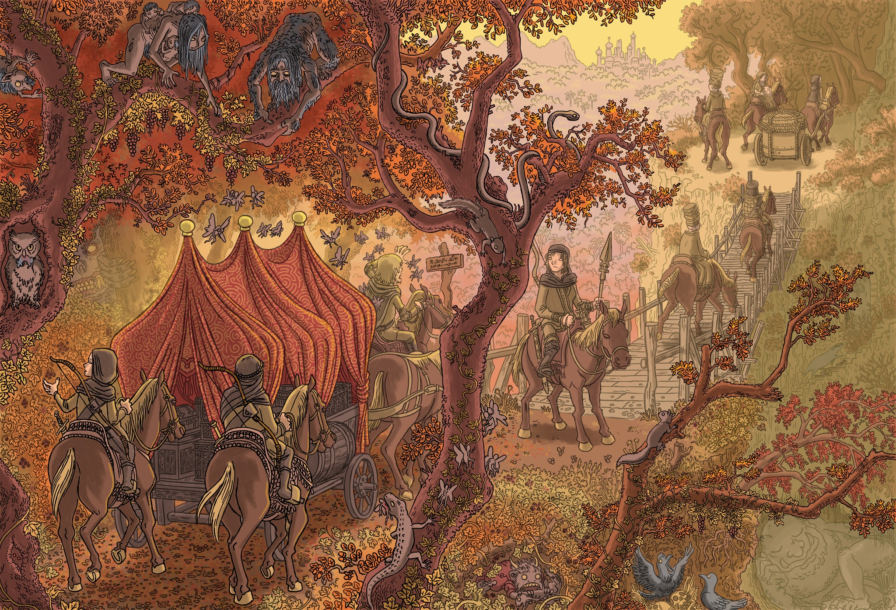

*Ilustração oficial de Old School Essentials por Peter Mullen*

**Dolmenwood**, criado por Gavin Norman, é um jogo que se inspira nas edições antigas de Dungeons & Dragons -- o que significa que ele se situa em uma tradição de RPG chamada de **OSR (Old School Revival, ou Old School Renaissance)**

Se você quer se aprofundar, eu recomendo o seminal [Principia Apocrypha](https://amarcelo.itch.io/principia-apochrypha-em-portugus) (tradução para o brasileiro por Tony Garcia), mas eu vou tentar resumir.

Primeiro, uma lista por **Ben Milton** de elementos que conjuram o OSR: 

> _"Alta letalidade, um mundo aberto, uma falta de um roteiro pré-escrito, ênfase na resolução criativa de problemas, um sistema de recompensa centrado na exploração (geralmente XP por tesouro), uma desconsideração pelo “equilíbrio do encontro” [ou nivelamento], e o uso de tabelas aleatórias para gerar elementos do mundo que surpreendem tanto jogadores e mestres. Além disso, uma forte ênfase no “faça você mesmo” e uma vontade de compartilhar seu trabalho e usar a criatividade de outras pessoas em seus jogos"_

Nada disso por si só explica a "filosofia" ou o "espírito" de jogos OSR, mas a combinação de alguns desses elementos costuma invocar um tipo de experiência que pode pegar desprevenido quem está acostumado com um sistema mais moderno e robusto como **D&D 5e**, ou quem espera uma maior flexibilidade narrativa como nos sistemas **PbtA**.

Em outras palavras, o rótulo OSR implica, entre outras coisas, que 

+ "Esse é um jogo sobre interagir com o mundo ficcional **como se fosse um lugar que de fato existe**"
+ "Matar coisas **não é o objetivo**"
+ "**Você** joga como o seu personagem, e não como o roteirista do seu personagem"
+ ...entre outras máximas e axiomas (e você vai perceber que é uma galera que gosta muito dos seus axiomas)

## ❓ Você precisa entender alguma coisa do que eu estou falando pra jogar Dolmenwood com a gente?

## ❌ É claro que não.  

"Comprar" essa filosofia de jogo não é necessária, e se ainda soa meio confuso não se preocupe, esse entendimento se constrói na mesa (ou, no nosso caso, no Discord). Mas também é útil manter alguns princípios em mente, para que todos que venham jogar estejam com as expectativas mais ou menos alinhadas, e pra que todos possamos aproveitar a experiência da melhor forma.

---

*Ilustração oficial de Dolmenwood por Elliot Lang*

### ⚙️ Mais detalhes sobre OSR

Uma das vantagens do OSR para uma mesa aberta são seus sistemas de regras simples, e que permitem a tomada de decisões justas e narrativamente consistentes por parte do árbitro. 

A simplicidade das regras faz com que OSR seja bem intuitivo... contanto que você esteja disposto a jogar como um aventureiro competente mas não muito (talvez "um herói, não um super-herói"), interessado em sobreviver, fazer algum dinheiro, e conhecer o mundo de Dolmenwood e seus habitantes. 

Mas a simplicidade da regra funciona com base em outras regras implícitas. O acordo tácito que garante o espírito do jogo, a confiança mútua...

Da parte dos jogadores, de que o árbitro será justo e representará o mundo de maneira honesta, com o melhor da sua habilidade, e recompensará a criatividade dos jogadores com arbitrações coerentes (rulings, not rules)

Da parte do árbitro, de que os jogadores se envolverão com o mundo em boa fé, e usarão sua criatividade dentro da ficção e da lógica interna do mundo (play the world, not the rules)

---

*Ilustração oficial de Dreamland RPG por Jason Bradley Thompson*

### 🗺️ Mais alguns detalhes sobre RPGs focados na exploração

Este é um jogo que foca bastante nas amplas possibilidades e longas travessias pelas florestas de Dolmenwood. Isso significa que você irá se preocupar com uma série de coisas que 
à primeira vista podem parecer mundanas e sacais pra muita gente, mas a promessa é que esse também é o motor que permite a aventura. 

**Coisas como:**

+ **Suprimentos:** comida, tochas, e o preço da estalagem
+ **Inventário:** quantos itens seu personagem consegue carregar confortavelmente (e como tirar todo aquele tesouro daquela caverna)
+ **Logística:** quantos quilômetros seu personagem consegue viajar por dia com esse peso todo, antes que seu grupo precise acampar

É essa pequena burocracia e essas pequenas decisões de gerenciamento de recursos (e o negligenciamento desses recursos...) que irão gerar situações, complicações, e possibilidades para os personagens viajando por esse mundo aberto sem uma história pré-estabelecida.

Ficar sem comida talvez force uma **aliança indesejada**, ou necessite uma **caça arriscada**; levar mais tempo no caminho de casa também significa o risco de **mais encontros** (nem todos hostis, mas ninguém quer pagar pra ver); acampar **sem o equipamento adequado** e dormir no sereno pode não ser ideal se o plano é explorar **aquela ruína assombrada** amanhã.

É um pequeno preço que pagamos para jogar em um mundo responsivo, onde as decisões dos jogadores são relevantes, e para que a sobrevivência dos jogadores e o sucesso de cada expedição estejam em suas próprias mãos -- e não sob o controle incondicional do árbitro.

Se no início é necessário contar a quantidade de tochas, isso também significa que mais tarde os jogadores podem usar o seu tempo e dinheiro suado para 

+ estabelecer uma rota de comércio com uma cidade vizinha;
+ organizar uma célula revolucionária para derrubar um tirano local;
+ fundar uma instituição para ajudar todos aqueles que sofrem de saudades eternas do mundo das fadas;
+ ou qualquer outra coisa que faça sentido dentro do mundo. 

E essa recompensa talvez pareça mais valiosa, quando você lembrar que seu personagem e seus amigos da guilda quase foram de base tentando trazer aquele item mágico pra casa no meio da noite, com fome e frio. (Ok, um dos preceitos do OSR é que seu personagem tem uma boa chance de morrer, mas a gente cruza essa ponte quando chegarmos nela. Pensamento positivo).

---

### 📚 Mais alguns recursos sobre OSR e afins:

+ Principia Apocrypha
+ Quick Primer
+ 6 Axioms of OSR
+ What is the OSR style (video)
