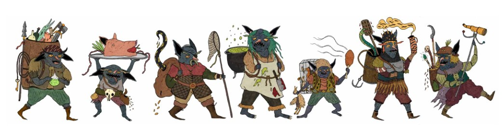

# Classes  

## Bardo
*Músicos e poetas atraídos por uma vida de viagem e aventura.*

#### Atributos & Combate

| | |
| :---------------- | :----------------------------------------------------------------------- |
| **Atributos Principais** | Carisma e Destreza |
| **Vida** | 1d6 por Nível, +1 após Nível 10 |
| **Aptidão em Combate** | Semimarcial |
| **Armaduras** | Leves e médias (escudos não permitidos) |
| **Armas** | Pequenas e médias |

#### Perícias & Habilidades Especiais

| | |
| :--- | :--- |
| **Perícias** | Decifrar Documento, Prestidigitação, Conhecimento sobre Monstros |
| **Contra-encanto** | Enquanto toca e canta, concede aliados próximos imunidade a efeitos mágicos sonoros e +2 em Salvaguarda contra magia de fadas. |
| **Encantamento** | Através de sua música e canto, pode fascinar criaturas em uma área. |

## Clérigo
*Guerreiros sagrados a serviço da Igreja Pluritina.*

#### Atributos & Combate

| | |
| :---------------- | :----------------------------------------------------------------------- |
| **Atributo Principal** | Sabedoria |
| **Vida** | 1d6 por Nível, +1 após Nível 10 |
| **Aptidão em Combate** | Semimarcial |
| **Armaduras** | Qualquer, incluindo escudos (exceto armaduras de magia arcana ou feérica) |
| **Armas** | Qualquer (exceto armas de magia arcana ou feérica) |

#### Perícias & Habilidades Especiais

| | |
| :--- | :--- |
| **Detectar Itens Sagrados** | Pode detectar itens encantados com magia sagrada. |
| **Magia Sagrada** | Conjura magias divinas (ver sistema de magia sagrada na p. 100 do DPB). |
| **Ordem Sagrada** | No nível 2, o clérigo é iniciado em uma ordem sagrada. |
| **Idiomas** | Fala Litúrgico, o idioma das escrituras da Igreja, além de seus idiomas nativos. |
| **Repelir Mortos-Vivos** | Pode tentar afastar mortos-vivos com seu símbolo sagrado. |

## Encantador
*Andarilhos que manipulam a magia das Fadas, conquistando favores da nobreza feérica.*

#### Atributos & Combate

| | |
| :---------------- | :----------------------------------------------------------------------- |
| **Atributo Principal** | Carisma e Inteligência |
| **Vida** | 1d6 por Nível, +1 após Nível 10 |
| **Aptidão em Combate** | Semimarcial |
| **Armaduras** | Leves e médias (escudos não permitidos) |
| **Armas** | Pequenas e médias |

#### Perícias & Habilidades Especiais

| | |
| :--- | :--- |
| **Detectar Magia** | Pode detectar magia em objetos encantados, lugares, ou criaturas. |
| **Runas das Fadas** | Podem usar as runas das fadas. |
| **Glamour** | Pequenos talentos mágicos |
| **Resistência a Ajuda Divina** | Magias divinas benéficas tem 2-em-6 chances de falhar. |

## Lutador
*Mercenários, soldados, e rufiões que usam seus talentos para uma vida de aventura.*

#### Atributos & Combate

| | |
| :---------------- | :----------------------------------------------------------------------- |
| **Atributo Principal** | Força |
| **Vida** | 1d8 por Nível, +2 após Nível 10 |
| **Aptidão em Combate** | Marcial |
| **Armaduras** | Qualquer uma, incluindo escudos |
| **Armas** | Qualquer uma |

#### Perícias & Habilidades Especiais

| | |
| :--- | :--- |
| **Talentos de Combate** | No nível 2, 6, 10, e 14, escolhe um talento especial. |

## Frei
*Andarilhos ascetas que espalham o evangelho da Igreja Pluritina.*

#### Atributos & Combate

| | |
| :---------------- | :----------------------------------------------------------------------- |
| **Atributo Principal** | Inteligência e Sabedoria |
| **Vida** | 1d4 por Nível, +1 após Nível 10 |
| **Aptidão em Combate** | Não-Marcial |
| **Armaduras** | Nenhuma |
| **Armas** | Clava, adaga, água benta, óleo, funda, cajado, tocha |

#### Perícias & Habilidades Especiais

| | |
| :--- | :--- |
| **Armadura de Fé** | Bônus de AC baseado em nível. |
| **Implementos Culinários** | Pode usar instrumentos de cozinha como arma de curta distância (panelas, salsichas, etc) por 1d4 de dano. |
| **Herbalista** | Uma dose única de erva medicinal dá para 2 pessoas. |
| **Magia Sagrada** | Conjura magias divinas (ver sistema de magia sagrada na p. 100 do DPB). |
| **Idiomas** | Fala Litúrgico, o idioma das escrituras da Igreja, além de seus idiomas nativos. |
| **Voto de Pobreza** | Posses limitadas ao que pode ser carregado. Excesso deve ser doado para causas nobres (não para outros jogadores). |
| **Repelir Mortos-Vivos** | Pode tentar afastar mortos-vivos com seu símbolo sagrado. |

## Caçador
*Rastreadores, perseguidores, e assassinos, em casa na floresta selvagem.*

#### Atributos & Combate

| | |
| :---------------- | :----------------------------------------------------------------------- |
| **Atributo Principal** | Constituição e Destreza |
| **Vida** | 1d8 por Nível, +2 após Nível 10. |
| **Aptidão em Combate** | Marcial |
| **Armaduras** | Leve, escudos |
| **Armas** | Qualquer uma |

#### Perícias & Habilidades Especiais

| | |
| :--- | :--- |
| **Companheiros Animais** | Pode formar um vínculo com um animal que se torna seu companheiro (limite de 1). |
| **Habilidades especializadas** | Alerta, Econder-se, Rastrear. |
| **Ataque à Distância** | +1 de bônus de ataque com armas à distância |
| **Troféus** | Após uma caça, pode pegar um troféu para ganhar +1 permanente contra a criatura. |
| **Orientação** | Tem uma chance de 3-em-6 de se reorientar quando o grupo se perde. |

## Cavaleiro
*Guerreiros que servem a um nobre, cumprindo suas ordens e garantindo sua honra.*

#### Atributos & Combate

| | |
| :---------------- | :----------------------------------------------------------------------- |
| **Atributo Principal** | Carisma e Força |
| **Vida** | 1d8 por Nível, +2 após Nível 10. |
| **Aptidão em Combate** | Marcial |
| **Armaduras** | Médias, pesadas, e escudos |
| **Armas** | Qualquer arma corpo-a-corpo |

#### Perícias & Habilidades Especiais

| | |
| :--- | :--- |
| **Suseranos** | Serve a uma das casas nobres menores em Dolmenwood (à partir do nível 3; até lá, é um escudeiro errante). |
| **Código de Cavaleiro** | Deve seguir um código estrito: honra, serviço, glória, proteger os fracos, e hierarquia. |
| **Montaria** | Peritos em montar cavalos |
| **Matador de Monstros** | +2 em ataques e dano contra criaturas Grandes (a partir do nível 5) |
| **Força de Vontade** | +2 em Testes de Resistência contra magia de fadas e efeitos de medo. |

## Mágico
*Connoisseurs de conhecimento arcano secreto que manipulam magia poderosa.*

#### Atributos & Combate

| | |
| :---------------- | :----------------------------------------------------------------------- |
| **Atributo Principal** | Inteligência |
| **Vida** | 1d4 por Nível, +1 após Nível 10 |
| **Aptidão em Combate** | Não-marcial |
| **Armaduras** | Nenhuma |
| **Armas** | Adaga, água benta, óleo, cajado, tocha. |

#### Perícias & Habilidades Especiais

| | |
| :--- | :--- |
| **Magia Arcana** | Conjura magias arcanas (ver p. 78). |
| **Detectar Magia** | Pode detectar magia em objetos encantados, lugares, ou criaturas. |
| **Livro de Feitiços Inicial** | Começa escolhendo um livro de feitiços contendo 3 feitiços de Ranque 1. |

## Ladino
*Trapaceiros que vivem de habilidades de engano e furtividade.*

#### Atributos & Combate

| | |
| :---------------- | :----------------------------------------------------------------------- |
| **Atributo Principal** | Destreza |
| **Vida** | 1d4 por Nível, +1 após Nível 10 |
| **Aptidão em Combate** | Semimarcial |
| **Armaduras** | Leves, sem escudos |
| **Armas** | Pequenas e médias |

#### Perícias & Habilidades Especiais

| | |
| :--- | :--- |
| **Golpe pelas Costas** | +4 de bônus de ataque e causa 2d4+4 ao atacar pelas costas com uma adaga. |
| **Perícias** | Escalar paredes, decifrar documentos, desarmar mecanismos, prestidigitação, escutar, arrombar fechaduras, furtividade. |
| **Canto dos Ladrões** | Além de sua língua nativa, ladinos podem aprender uma língua secreta de gestos e códigos que permitem esconder mensagens em conversas aparentemente normais. |
