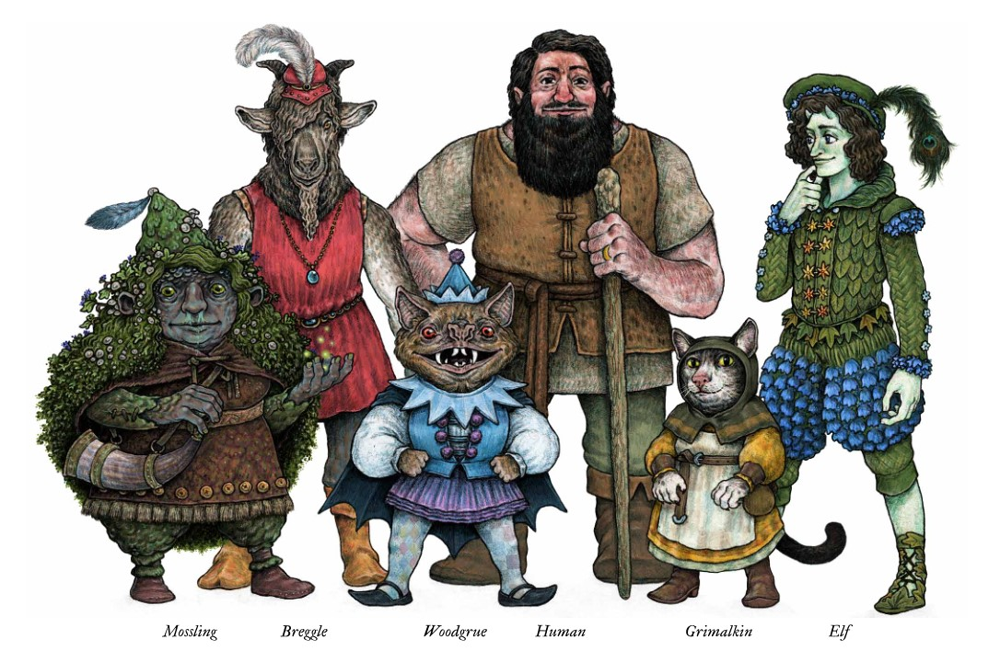

# Kins de Dolmenwood

## Mossling

| Categoria         | Detalhes                                                                 |
| :---------------- | :----------------------------------------------------------------------- |
| **Descrição**     | Criaturas pequenas e resistentes, cobertas por musgo e fungos.           |
| **Tipo**          | Mortal                                                                   |
| **Classes**       | Bardo, Lutador, Ranger, Ladino                                           |
| **Traços**        | Visão no escuro, Resistência a venenos, Movimento lento em ambientes secos |
| **Afinidade**     | Bosques úmidos, pântanos, cavernas                                       |

## Breggle

| Categoria         | Detalhes                                                                 |
| :---------------- | :----------------------------------------------------------------------- |
| **Descrição**     | Um povo pequeno e robusto, conhecido por sua teimosia e conexão com a terra. |
| **Tipo**          | Mortal                                                                   |
| **Classes**       | Clérigo, Lutador, Mago, Ranger                                          |
| **Traços**        | +2 em testes de resistência, Cansee em infravermelho, Teimoso           |
| **Afinidade**     | Montanhas, colinas, minas                                               |

## Woodgrue

| Categoria         | Detalhes                                                                 |
| :---------------- | :----------------------------------------------------------------------- |
| **Descrição**     | Seres enigmáticos e silenciosos, quase imperceptíveis na floresta.       |
| **Tipo**          | Imortal                                                                  |
| **Classes**       | Druida, Ranger, Ladino, Mago                                            |
| **Traços**        | Camuflagem natural, Silêncio natural, Vulnerável a ferro                 |
| **Afinidade**     | Florestas densas, lugares não mapeados                                   |

## Humano

| Categoria         | Detalhes                                                                 |
| :---------------- | :----------------------------------------------------------------------- |
| **Descrição**     | Adaptáveis e ambiciosos, os humanos se espalham por todos os cantos.     |
| **Tipo**          | Mortal                                                                   |
| **Classes**       | Todas as classes                                                         |
| **Traços**        | Bônus em qualquer habilidade, Versáteis, Sem resistências especiais      |
| **Afinidade**     | Qualquer lugar, especialmente cidades e estradas                         |

## Grimalkin

| Categoria         | Detalhes                                                                 |
| :---------------- | :----------------------------------------------------------------------- |
| **Descrição**     | Povo-gato misterioso, conhecido por sua curiosidade e habilidades furtivas. |
| **Tipo**          | Mortal                                                                   |
| **Classes**       | Ladino, Bardo, Mago, Druida                                             |
| **Traços**        | Visão noturna, Passos silenciosos, 7 vidas (vantagem contra morte)       |
| **Afinidade**     | Telhados, florestas noturnas, lugares altos                              |

## Elfo

| Categoria         | Detalhes                                                                 |
| :---------------- | :----------------------------------------------------------------------- |
| **Descrição**     | Seres feéricos de beleza etérea e vida longa, conectados aos segredos do bosque. |
| **Tipo**          | Imortal                                                                  |
| **Classes**       | Mago, Druida, Ranger, Bardo                                             |
| **Traços**        | Imune a sono, Encantamento com palavras, Vulnerável a ferro frio         |
| **Afinidade**     | Clareiras lunares, bosques antigos, lugares mágicos                      |
